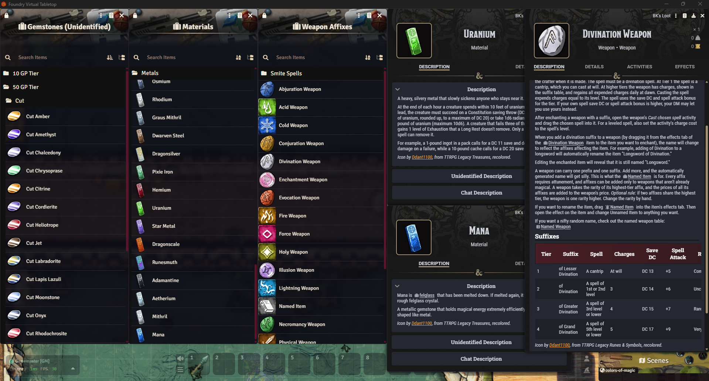

# BK's Loot



## Installation

In Foundry's setup screen, go to "Add-on Modules," click "Install Module," and paste this manifest URL into the field at the bottom:

```
https://github.com/bklick/bk-loot/releases/latest/download/module.json
```

Then enable "BK's Loot" in your world under Game Settings > Manage Modules.

Alternatively, download `bk-loot.zip` from the [latest release](https://github.com/bklick/bk-loot/releases/latest) and extract it into your Foundry `Data/modules` folder.

This is a compendium of treasure items for version 14 of FoundryVTT's D\&D5e system, so that DMs can easily drag loot into their players' inventories without having to spend a lot of time hand-crafting loot.

I am making these compendiums because when I give out loot I hadn't prepared in the VTT in advance, my players have told me that they felt like it was "pity loot" that I made up on-the-spot. As I literally never do this, I figured I would fix the problem for the forseeable future for myself.

Clearly, then, loot with an icon and a description adds to the enjoyment (or perhaps the sense of fairness?) of the game for some players. I aim to provide that here, and to expand the module periodically.

These are meant to be items that you can plug and play into any session. While nothing here is necessarily specific to D\&D 5.5e, I created it with that system in mind - I used that game's pattern to determine how much gold each gem is worth. Also, you know, I measure value in gold, which plenty of systems do not.

The first release is a collection of gemstone items. The gems do not have weight because even at my worst, most spendthrifty trip to a gem and mineral show, I have never had so many gems that I couldn't carry more of them.

Enjoy, and please feel free to raise any questions, comments, thoughts, or concerns [here](https://github.com/bklick/bk-loot/issues).

## Contents to Date

* 86 types of gemstones with custom art, gold values, and short encyclopedia-style descriptions.
* Two compendia with the gemstones sorted into value tiers of 10, 50, 100, 500, 1000, and 5000gp. One compendium has the same gemstones, but in an unidentified state for DMs who prefer to use rules and mechanics related to identifying loot.

## Using this Content

This module will create a new compendium folder called "BK's Loot," which will expand to show the contents. If these are not visible, check to make sure that the module has been activated.

To create a quick loot table with these items, right-click on any of the folders one level above the gemstone items in their compendia and in the context menu, select "create rollable table." The table will appear in your tables tab.

## Version History

**1.0.0** (9-27-2026): Initial release. Gemstone compendia.

## Credits

Gemstone art by [Ddant1100](https://ddant1100.itch.io), from the TTRPG Legacy Gemstones packs, used under the artist's license, which permits commercial and non-commercial use with credit. Some icons were recolored from the artist's grayscale originals.

Gemstone descriptions are original summaries of the following Wikipedia articles, retrieved September 2026:

* https://en.wikipedia.org/wiki/Agate
* https://en.wikipedia.org/wiki/Amazonite
* https://en.wikipedia.org/wiki/Amber
* https://en.wikipedia.org/wiki/Amethyst
* https://en.wikipedia.org/wiki/Ametrine
* https://en.wikipedia.org/wiki/Andradite
* https://en.wikipedia.org/wiki/Aquamarine\_(gem)
* https://en.wikipedia.org/wiki/Aventurine
* https://en.wikipedia.org/wiki/Azurite
* https://en.wikipedia.org/wiki/Beryl
* https://en.wikipedia.org/wiki/Carnelian
* https://en.wikipedia.org/wiki/Chalcedony
* https://en.wikipedia.org/wiki/Chrysoberyl
* https://en.wikipedia.org/wiki/Chrysoprase
* https://en.wikipedia.org/wiki/Citrine
* https://en.wikipedia.org/wiki/Conch\_pearl
* https://en.wikipedia.org/wiki/Cordierite
* https://en.wikipedia.org/wiki/Diamond\_(gemstone)
* https://en.wikipedia.org/wiki/Diamond\_color
* https://en.wikipedia.org/wiki/Emerald
* https://en.wikipedia.org/wiki/Fluorite
* https://en.wikipedia.org/wiki/Garnet
* https://en.wikipedia.org/wiki/Grossular
* https://en.wikipedia.org/wiki/Heliotrope\_(mineral)
* https://en.wikipedia.org/wiki/Hematite
* https://en.wikipedia.org/wiki/Howlite
* https://en.wikipedia.org/wiki/Jadeite
* https://en.wikipedia.org/wiki/Jasper
* https://en.wikipedia.org/wiki/Jet\_(lignite)
* https://en.wikipedia.org/wiki/Labradorite
* https://en.wikipedia.org/wiki/Lapis\_lazuli
* https://en.wikipedia.org/wiki/Malachite
* https://en.wikipedia.org/wiki/Moonstone\_(gemstone)
* https://en.wikipedia.org/wiki/Moss\_agate
* https://en.wikipedia.org/wiki/Musgravite
* https://en.wikipedia.org/wiki/Nephrite
* https://en.wikipedia.org/wiki/Obsidian
* https://en.wikipedia.org/wiki/Onyx
* https://en.wikipedia.org/wiki/Opal
* https://en.wikipedia.org/wiki/Pearl
* https://en.wikipedia.org/wiki/Peridot
* https://en.wikipedia.org/wiki/Precious\_coral
* https://en.wikipedia.org/wiki/Pyrite
* https://en.wikipedia.org/wiki/Quartz
* https://en.wikipedia.org/wiki/Red\_beryl
* https://en.wikipedia.org/wiki/Rhodochrosite
* https://en.wikipedia.org/wiki/Rhodonite
* https://en.wikipedia.org/wiki/Rose\_quartz
* https://en.wikipedia.org/wiki/Ruby
* https://en.wikipedia.org/wiki/Sapphire
* https://en.wikipedia.org/wiki/Serpentine\_subgroup
* https://en.wikipedia.org/wiki/Smoky\_quartz
* https://en.wikipedia.org/wiki/Sodalite
* https://en.wikipedia.org/wiki/Spessartine
* https://en.wikipedia.org/wiki/Spinel
* https://en.wikipedia.org/wiki/Spodumene
* https://en.wikipedia.org/wiki/Sunstone
* https://en.wikipedia.org/wiki/Taaffeite
* https://en.wikipedia.org/wiki/Tahitian\_pearl
* https://en.wikipedia.org/wiki/Tanzanite
* https://en.wikipedia.org/wiki/Tiger%27s\_eye
* https://en.wikipedia.org/wiki/Topaz
* https://en.wikipedia.org/wiki/Tourmaline
* https://en.wikipedia.org/wiki/Turquoise
* https://en.wikipedia.org/wiki/Zircon

Wikipedia content is available under CC BY-SA 4.0.

Felglass and its description are by Bartholomew Klick.

## About AI in this module

The gemstone art is by Ddant1100 and was not made with AI. Some icons were recolored from the artist's grayscale originals using a gradient map.

I built this module with the help of Claude, an AI assistant. Claude drafted the gemstone descriptions from the linked Wikipedia articles, because there are more than 250 items as of this writing sharing roughly 90 descriptions and I value my wrists.

More seriously, dry descriptions of gemstones are not appealing to create, but seem important to have in content like this. I frequently see people say, "If you didn't bother to write it, why should I bother to read it?" It's a really damn good question, but in this case, I don't expect anyone to read these for enjoyment or mental stimulation. Rather, I expect players to receive their loot, glance at the description for very basic facts about the item, and then continue playing the game.

In that spirit, Claude has helped me to automate tedious or repetitive parts of preparing this content. Without this help, it would be at the top of my pile of unfinished, unshared creations.

The gem list, values, forms, and overall design are my decisions. Felglass is my own creation and the short description of it is wholly mine. If I continue to add content to this module, I will expand on any sources of generative content either here or in the version notes, while putting human contributions in the credits.

I understand and share many concerns about LLMs, particularly with energy use and how they have been trained, but choose to engage with the tools because they have helped me create things after a long period of depression. Thank you for your understanding.

As a writer, I feel like I have skin in the game, so-to-speak, about the use of tools that generate text in my chosen form of art.

Out of solidarity with the artists in my life, and out of respect for the artists I admire, I will not knowingly use AI art. I do not expect this policy to change, outside of some massive paradigm change. The cultural use of art is very different, in my opinion, than the cultural use of written copy.

## License

BK's Loot contains material under different terms. Please check which part you want to use. The gemstone art belongs to Ddant1100 and is not covered by this module's licenses. Written content is licensed under CC BY 4.0, and code under the MIT License. See [LICENSE.md](LICENSE.md) for the full terms.

